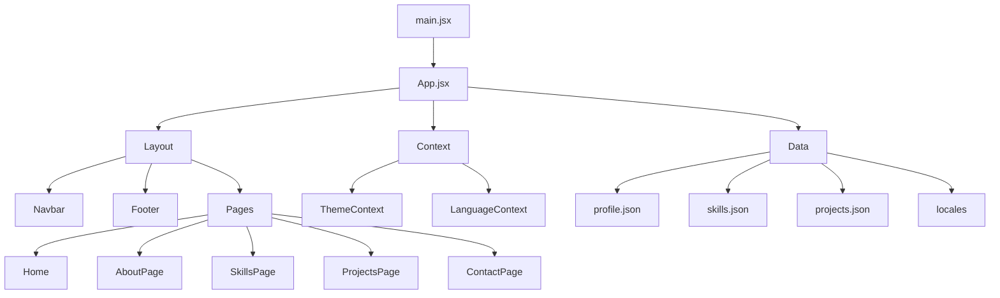

# Portfolio - Umut Arda Tansever

A personal portfolio site built with React and Vite. It brings together multilingual content, theme switching, project showcases, and contact flows in a single clean experience.

<div align="center">
  <a href="https://umutardatansever.github.io/MyPortfolio/" target="_blank" rel="noreferrer noopener">
    
  </a>
</div>

## Overview

This project was developed for the Web Technologies course at Istanbul Rumeli University, Department of Computer Engineering. The focus is readability, modularity, and a smooth content-driven browsing flow.

## Architecture



## Layers

### Presentation layer
`src/components` contains the reusable Layout, Sections, and UI components. These pieces handle structure, repeated interface patterns, and interaction states.

### Page layer
`src/pages` defines one component per route. This keeps the app organized as the content grows.

### State and content layer
`src/context` manages theme and language state. `src/data` stores profile, skills, project, and translation content in JSON format.

## Directory Structure

```text
src/
├── assets/
├── components/
│   ├── Layout/
│   ├── Sections/
│   └── UI/
├── context/
├── data/
│   └── locales/
├── pages/
├── App.jsx
├── App.css
├── main.jsx
└── index.css
```

## Technology Stack

| Technology | Role |
|---|---|
| React | UI layer |
| Vite | Development and build tooling |
| React Router | Route navigation |
| Context API | Theme and language state |
| CSS Variables | Theme tokens |
| Local Storage | Persisted user preferences |
| React Icons | Icon set |

## Key Features

| Area | Detail |
|---|---|
| Theme | Dark and light mode support |
| Language | Turkish and English content |
| Projects | Category filtering and modal details |
| Contact | Form-oriented contact section |
| CV | PDF download flow |
| Responsive | Mobile-friendly layout |

## Routes

| Route | Page |
|---|---|
| `/` | Home |
| `/hakkimda` | About |
| `/yetenekler` | Skills |
| `/projeler` | Projects |
| `/iletisim` | Contact |

## Data Flow

`profile.json`, `skills.json`, and `projects.json` are the main content sources for the interface. `locales/tr.json` and `locales/en.json` provide all translatable text.

## Run Locally

### Requirements
- Node.js 16 or newer
- npm

### Install and start

```bash
npm install
npm run dev
```

The development server opens at `http://localhost:5173` by default.

### Production build

```bash
npm run build
```

## Developer

Umut Arda Tansever

- GitHub: https://github.com/umutardatansever
- LinkedIn: https://www.linkedin.com/in/umut-arda-tansever-15606a369
- Email: umutarda.tansever@stu.rumeli.edu.tr

## Note

This project was developed for educational purposes.
